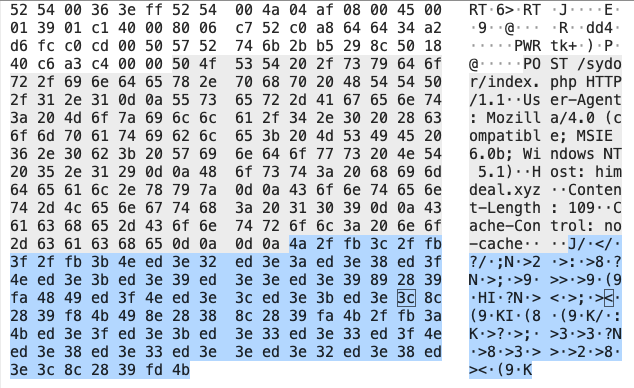

# Azorult

# Links:
https://app.any.run/tasks/c951ec23-dfcc-4c80-870b-e5247fc9d604/

# Protocols:
HTTP
DNS

# Ports:
80
53

# Sample:



```
<d>ZmlyZWZveC5leGUNClNPRlRXQVJFXFdvdzY0MzJOb2RlXE1vemlsbGFcTW96aWxsYSBGaXJlZm94XA0KU09GVFdBUkVcTW96aWxsYVxNb3ppbGxhIEZpcmVmb3gNClNPRlRXQVJFXENsaWVudHNcU3RhcnRNZW51SW50ZXJuZXRcRklSRUZPWC5FWEVcc2hlbGxcb3Blblxjb21tYW5kDQpTT0ZUV0FSRVxNaWNyb3NvZnRcV2luZG93c1xDdXJyZW50VmVyc2lvblxBcHAgUGF0aHNcZmlyZWZveC5leGUNCiVhcHBkYXRhJVxNb3ppbGxhXEZpcmVmb3hcUHJvZmlsZXNcDQpNb3ppbGxhRmlyZUZveA0KQ3VycmVudFZlcnNpb24NCkluc3RhbGxfRGlyZWN0b3J5DQpuc3MzLmRsbA0KdGh1bmRlcmJpcmQuZXhlDQpTT0ZUV0FSRVxXb3c2NDMyTm9kZVxNb3ppbGxhXE1vemlsbGEgVGh1bmRlcmJpcmRcDQpTT0ZUV0FSRVxNb3ppbGxhXE1vemlsbGEgVGh1bmRlcmJpcmQNClNPRlRXQVJFXENsYXNzZXNcVGh1bmRlcmJpcmRFTUxcRGVmYXVsdEljb24NCiVhcHBkYXRhJVxUaHVuZGVyYmlyZFxQcm9maWxlc1wNClRodW5kZXJCaXJkDQpTRUxFQ1QgaG9zdCwgcGF0aCwgaXNTZWN1cmUsIGV4cGlyeSwgbmFtZSwgdmFsdWUgRlJPTSBtb3pfY29va2llcw0KU0VMRUNUIGZpZWxkbmFtZSwgdmFsdWUgRlJPTSBtb3pfZm9ybWhpc3RvcnkNCk5TU19Jbml0DQpQSzExX0dldEludGVybmFsS2V5U2xvdA0KUEsxMV9BdXRoZW50aWNhdGUNClBLMTFTRFJfRGVjcnlwdA0KTlNTX1NodXRkb3duDQpQSzExX0ZyZWVTbG90DQpsb2dpbnMuanNvbg0KbG9naW5zDQpob3N0bmFtZQ0KdGltZXNVc2VkDQplbmNyeXB0ZWRVc2VybmFtZQ0KZW5jcnlwdGVkUGFzc3dvcmQNCmNvb2tpZXMuc3FsaXRlDQpmb3JtaGlzdG9yeS5zcWxpdGUNCiVMT0NBTEFQUERBVEElXEdvb2dsZVxDaHJvbWVcVXNlciBEYXRhXA0KJUxPQ0F
```

```
<d>
firefox.exe
SOFTWARE\Wow6432Node\Mozilla\Mozilla Firefox\
SOFTWARE\Mozilla\Mozilla Firefox
SOFTWARE\Clients\StartMenuInternet\FIREFOX.EXE\shell\open\command
SOFTWARE\Microsoft\Windows\CurrentVersion\App Paths\firefox.exe
%appdata%\Mozilla\Firefox\Profiles\
MozillaFireFox
CurrentVersion
Install_Directory
nss3.dll
thunderbird.exe
SOFTWARE\Wow6432Node\Mozilla\Mozilla Thunderbird\
SOFTWARE\Mozilla\Mozilla Thunderbird
SOFTWARE\Classes\ThunderbirdEML\DefaultIcon
%appdata%\Thunderbird\Profiles\
ThunderBird
SELECT host, path, isSecure, expiry, name, value FROM moz_cookies
SELECT fieldname, value FROM moz_formhistory
NSS_Init
PK11_GetInternalKeySlot
PK11_Authenticate
PK11SDR_Decrypt
NSS_Shutdown
PK11_FreeSlot
logins.json
logins
hostname
timesUsed
encryptedUsername
encryptedPassword
cookies.sqlite
formhistory.sqlite
%LOCALAPPDATA%\Google\Chrome\User Data\
```
