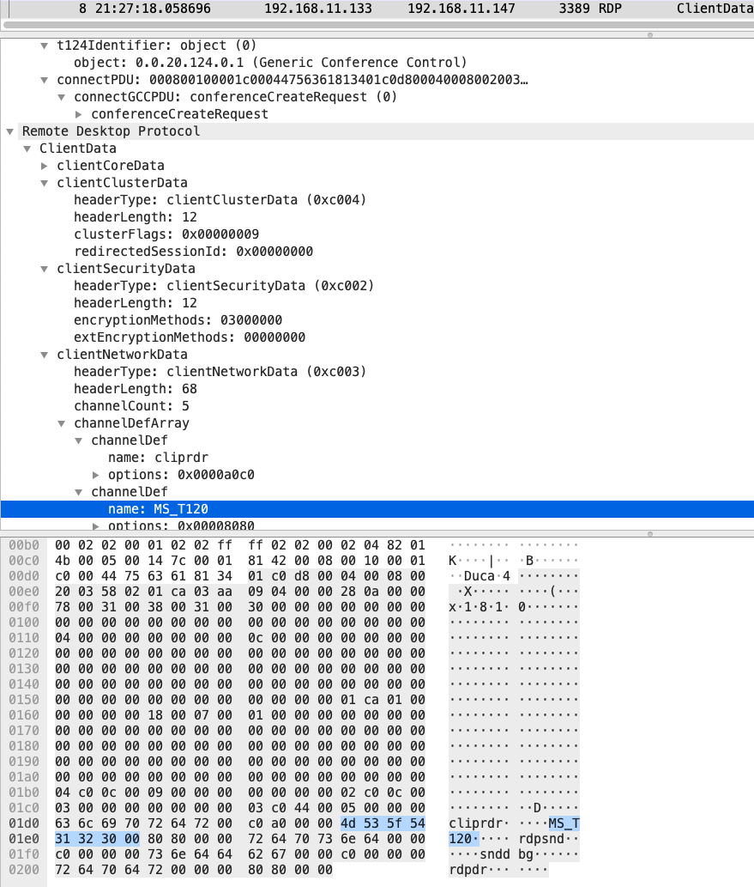

# CVE-2019-0708 Metaploit Scanner Module

# Links:
https://securingtomorrow.mcafee.com/other-blogs/mcafee-labs/rdp-stands-for-really-do-patch-understanding-the-wormable-rdp-vulnerability-cve-2019-0708/

# Protocols:
TCP

# Ports:
3389

# Sample:

