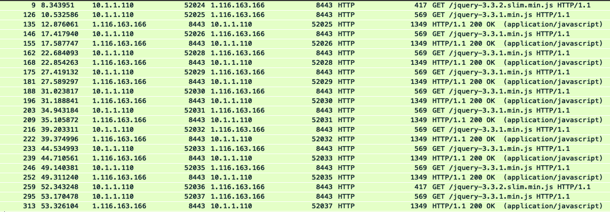
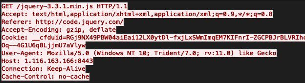

### Hashes:
- SHA256: 49c4d7eacd8d3cae5ac36eb50d1aef86dd396764b7c50963796b3e26d3a92300
- SHA1:   6482ea24ed4fa1b796e3e9747b91bfbcf4853340
- MD5:    44a17a2e5d45c16eb74fc24226b625f3

### Links:
- [VirusTotal](https://www.virustotal.com/gui/file/49c4d7eacd8d3cae5ac36eb50d1aef86dd396764b7c50963796b3e26d3a92300/details)
- [Twitter](https://twitter.com/z0ul_/status/1396908463213662208)
- [MalwareBytes](https://blog.malwarebytes.com/threat-analysis/2020/06/multi-stage-apt-attack-drops-cobalt-strike-using-malleable-c2-feature/)

### Screenshots:

