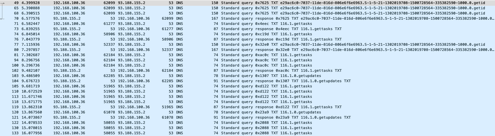

# Mozart

# Links:
https://www.bleepingcomputer.com/news/security/new-mozart-malware-gets-commands-hides-traffic-using-dns/
https://app.any.run/tasks/6a3aadc0-7914-4ade-8d4f-dda0f8ad3744/

# Protocols:
UDP
DNS

# Ports:
53

# Sample:

